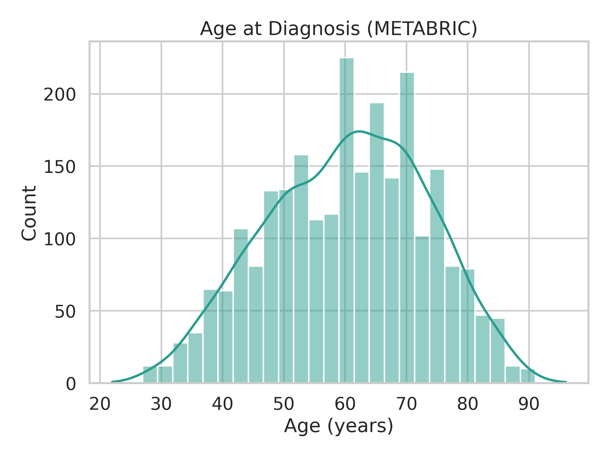
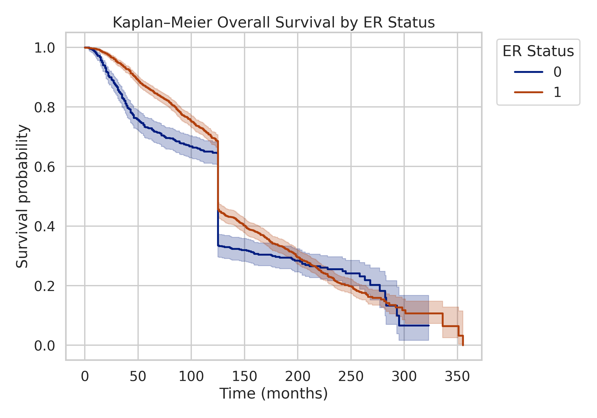

# METABRIC Clinical Report

**Dataset:** METABRIC_cleaned_imputed.csv  
**Generated:** 2025-12-08T12:37:26.001043Z

## Overview
- Study cohort summary and survival profiling for breast cancer patients.
- Assets stored in `reports/figures/` and `reports/tables/` for reproducibility.

## Figures
- Age distribution: 
- Kaplan–Meier by ER Status: 

## Tables
- Numeric summary: [CSV](../tables/numeric_summary.csv)
- Categorical frequencies: [CSV](../tables/categorical_frequencies_top25.csv)
- Survival aggregates by ER Status: [CSV](../tables/survival_agg_by_ER Status.csv)
- Cox model summary: [CSV](../tables/coxph_summary.csv), [LaTeX](../tables/coxph_summary.tex)

## Methods (brief)
- Kaplan–Meier curves stratified by ER Status, log-rank test for top two subtypes.
- Cox PH model fitted on selected covariates; hazard ratios reported with 95% CI.

## Reproducibility
- Schema snapshot: [JSON](../schema_snapshot.json)
- Code run in Google Colab; deterministic saving paths under `reports/`.
