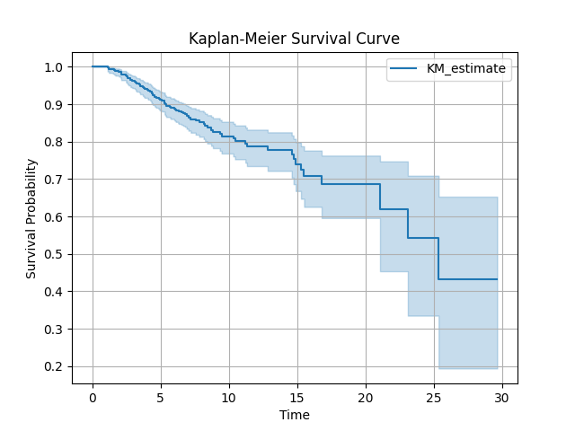

# FSGS Kidney Disease Survival Analysis Report

## Summary Statistics
| Unnamed: 0   |   outcome_dialysis_y_n |   FU_ESRD |   FU_15y_ESRD |   CensorHD_15y |   lostFU5yrs |   Death_or_HD |   Death_NoHD | treatment_response   |   relapse_Y_N |   relapse_number |   R_vs_NR | gender_0_1   |   bmi_kgm2 |      age |   hypertension | immunosuppresion_y_n   | acearb_y_n   |   egfr_ckd_epi_mlmin |   urine_protein_gday |    UPr_35g |   serum_albumin_gdl |   microspopic_hematuria | bx_date   | dialysis_date   |   yearstodialysis |   fu_month |   FU_years | transplant                                                                  |      id | patients   |        kg |       bmi |   year_of_birth | birthday   |   year_of_bx |   nephrotic |   serum_creatinine_mgdl |   serum_proteins_gdl |   cholesterol_mgdl |   triglycerides_mgdl |   hdl_mgdl |   hb_gdl |      hct_ |   antihypertensives0123 |   antihypertensive_drugs_y_n |   immunos_type |   type_of_immunosuppresion |   other_immunosuppresive_drugs_y_n | OnlyCsa_Onlyster_vsother   |   Cs_only_vs_Csa_vs_other | corticosteroids_y_n   |   cyclosporine_y_n | cyclophosphamide_y_n   | rituximab_y_n   |     mpa_y_n |   others_name |   complete_remission_y_n |   partial_remission_y_n |   no_response_y_n |   relapse_treatment_immunosuppresi |   relapse_treatment_type |   relapse_type_of_treatment |   relapse_treatment_corticosteroid |   relapse_treatment_cyclosporine_y |   relapse_treatment_cyclophosphami |   relapse_treatment_rituximab_y_n |   relapse_treatment_mpa_y_n |   relapse_treatment_other_drugs__y |   relapse_treatment_other_name | efu_date   |   efu_year |   efu_serum_creatinine_mgdl |   efu_egfr_ckd_epi_mlmin |   efu_urine_protein_gday |   efu_serum_protein_gdl |   efu_serum_albumin_gdl |   efu_cholesterol_mgdl |   efu_triglycerides_mgdl |   efu_immunosuppresion_y_n |   efu_treatment_type |   efu_immunosuppresion_type |   efu_corticosteroids_y_n |   efu_cyclosporine_y_n |   efu_cyclophosphamide_y_n |   efu_rituximab_y_n |   efu_mpa_y_n |   efu_other_drugs |   efu_antihypertensives |   efu_acearb_y_n |   efu_antihypertensives_y_n |    dx_year |   death_y_n | death_date   |   death_year | CB                                                                          | CC            | CD                                                                                                                                     |   CE |   CF |   CG |   CH |   CI |   CJ |   CK |   CL |   CM |   CN |   CO | biopsydate   |         xb |   _st |         _d |        _t |   _t0 |
|:-------------|-----------------------:|----------:|--------------:|---------------:|-------------:|--------------:|-------------:|:---------------------|--------------:|-----------------:|----------:|:-------------|-----------:|---------:|---------------:|:-----------------------|:-------------|---------------------:|---------------------:|-----------:|--------------------:|------------------------:|:----------|:----------------|------------------:|-----------:|-----------:|:----------------------------------------------------------------------------|--------:|:-----------|----------:|----------:|----------------:|:-----------|-------------:|------------:|------------------------:|---------------------:|-------------------:|---------------------:|-----------:|---------:|----------:|------------------------:|-----------------------------:|---------------:|---------------------------:|-----------------------------------:|:---------------------------|--------------------------:|:----------------------|-------------------:|:-----------------------|:----------------|------------:|--------------:|-------------------------:|------------------------:|------------------:|-----------------------------------:|-------------------------:|----------------------------:|-----------------------------------:|-----------------------------------:|-----------------------------------:|----------------------------------:|----------------------------:|-----------------------------------:|-------------------------------:|:-----------|-----------:|----------------------------:|-------------------------:|-------------------------:|------------------------:|------------------------:|-----------------------:|-------------------------:|---------------------------:|---------------------:|----------------------------:|--------------------------:|-----------------------:|---------------------------:|--------------------:|--------------:|------------------:|------------------------:|-----------------:|----------------------------:|-----------:|------------:|:-------------|-------------:|:----------------------------------------------------------------------------|:--------------|:---------------------------------------------------------------------------------------------------------------------------------------|-----:|-----:|-----:|-----:|-----:|-----:|-----:|-----:|-----:|-----:|-----:|:-------------|-----------:|------:|-----------:|----------:|------:|
| count        |             579        | 579       |     579       |     579        |          579 |    579        |   579        | 493                  |    579        |        579       |         0 | 579          |   579      | 579      |     579        | 500                    | 509          |             579      |            579       | 579        |          579        |              579        | 567       | 83              |         579       |   579      |  579       | 16                                                                          | 579     | 579        | 579       | 579       |        579      | 526        |    579       |  579        |               579       |           579        |           579      |              579     |   579      | 579      | 579       |               579       |                   579        |      579       |                  579       |                        579         | 295                        |                 579       | 463                   |         579        | 486                    | 484             | 579         |    579        |               579        |              579        |        579        |                         579        |                579       |                   579       |                         579        |                         579        |                        579         |                       579         |                 579         |                        579         |                    579         | 424        |  579       |                   579       |                 579      |                 579      |              579        |              453        |               450      |                 449      |                 579        |           579        |                   579       |               579         |            579         |               579          |                 579 |    579        |       579         |              579        |       579        |                  450        |  579       | 579         | 19           |    579       | 13                                                                          | 39            | 3                                                                                                                                      |    0 |    0 |    0 |    0 |    0 |    0 |    0 |    0 |    0 |    0 |    0 | 567          | 579        |   579 | 579        | 579       |   579 |
| unique       |             nan        | nan       |     nan       |     nan        |          nan |    nan        |   nan        | 3                    |    nan        |        nan       |       nan | 2            |   nan      | nan      |     nan        | 2                      | 2            |             nan      |            nan       | nan        |          nan        |              nan        | 532       | 82              |         nan       |   nan      |  nan       | 16                                                                          | nan     | 579        | nan       | nan       |        nan      | 417        |    nan       |  nan        |               nan       |           nan        |           nan      |              nan     |   nan      | nan      | nan       |               nan       |                   nan        |      nan       |                  nan       |                        nan         | 4                          |                 nan       | 2                     |         nan        | 2                      | 2               | nan         |    nan        |               nan        |              nan        |        nan        |                         nan        |                nan       |                   nan       |                         nan        |                         nan        |                        nan         |                       nan         |                 nan         |                        nan         |                    nan         | 349        |  nan       |                   nan       |                 nan      |                 nan      |              nan        |              nan        |               nan      |                 nan      |                 nan        |           nan        |                   nan       |               nan         |            nan         |               nan          |                 nan |    nan        |       nan         |              nan        |       nan        |                  nan        |  nan       | nan         | 19           |    nan       | 13                                                                          | 38            | 3                                                                                                                                      |  nan |  nan |  nan |  nan |  nan |  nan |  nan |  nan |  nan |  nan |  nan | 1            | nan        |   nan | nan        | nan       |   nan |
| top          |             nan        | nan       |     nan       |     nan        |          nan |    nan        |   nan        | PR                   |    nan        |        nan       |       nan | M            |   nan      | nan      |     nan        | Y                      | Y            |             nan      |            nan       | nan        |          nan        |              nan        | 2/20/2006 | 6/8/2018        |         nan       |   nan      |  nan       | ΔΙΑΓΝΩΣΗ ΜΕ ΚΑΚΟΗΘΕΙΑ ΤΡΑΧΗΛΟΥ - ΕΝΑΡΞΗ ΑΚΤΙΝΟΘΕΡΑΠΕΙΑΣ ΚΑΙ ΧΗΜΕΙΟΘΕΡΑΠΕΙΑΣ | nan     | P17        | nan       | nan       |        nan      | 1/1/1954   |    nan       |  nan        |               nan       |           nan        |           nan      |              nan     |   nan      | nan      | nan       |               nan       |                   nan        |      nan       |                  nan       |                        nan         | Cs_only                    |                 nan       | Y                     |         nan        | N                      | N               | nan         |    nan        |               nan        |              nan        |        nan        |                         nan        |                nan       |                   nan       |                         nan        |                         nan        |                        nan         |                       nan         |                 nan         |                        nan         |                    nan         | 5-Jul-20   |  nan       |                   nan       |                 nan      |                 nan      |              nan        |              nan        |               nan      |                 nan      |                 nan        |           nan        |                   nan       |               nan         |            nan         |               nan          |                 nan |    nan        |       nan         |              nan        |       nan        |                  nan        |  nan       | nan         | 12/17/2018   |    nan       | ΔΙΑΓΝΩΣΗ ΜΕ ΚΑΚΟΗΘΕΙΑ ΤΡΑΧΗΛΟΥ - ΕΝΑΡΞΗ ΑΚΤΙΝΟΘΕΡΑΠΕΙΑΣ ΚΑΙ ΧΗΜΕΙΟΘΕΡΑΠΕΙΑΣ | IgA-FSGS like | Ιιπαθης πιθανοτατα από την βιοψια. Παρουσιαστηκε με νεφρωσικου επιπεδου λευκωμαοτυρια Την βαζω για πληρεστερη  συμπληρωση  του αρχειου |  nan |  nan |  nan |  nan |  nan |  nan |  nan |  nan |  nan |  nan |  nan | 1/1/1960     | nan        |   nan | nan        | nan       |   nan |
| freq         |             nan        | nan       |     nan       |     nan        |          nan |    nan        |   nan        | 212                  |    nan        |        nan       |       nan | 378          |   nan      | nan      |     nan        | 309                    | 396          |             nan      |            nan       | nan        |          nan        |              nan        | 2         | 2               |         nan       |   nan      |  nan       | 1                                                                           | nan     | 1          | nan       | nan       |        nan      | 9          |    nan       |  nan        |               nan       |           nan        |           nan      |              nan     |   nan      | nan      | nan       |               nan       |                   nan        |      nan       |                  nan       |                        nan         | 135                        |                 nan       | 269                   |         nan        | 469                    | 477             | nan         |    nan        |               nan        |              nan        |        nan        |                         nan        |                nan       |                   nan       |                         nan        |                         nan        |                        nan         |                       nan         |                 nan         |                        nan         |                    nan         | 5          |  nan       |                   nan       |                 nan      |                 nan      |              nan        |              nan        |               nan      |                 nan      |                 nan        |           nan        |                   nan       |               nan         |            nan         |               nan          |                 nan |    nan        |       nan         |              nan        |       nan        |                  nan        |  nan       | nan         | 1            |    nan       | 1                                                                           | 2             | 1                                                                                                                                      |  nan |  nan |  nan |  nan |  nan |  nan |  nan |  nan |  nan |  nan |  nan | 567          | nan        |   nan | nan        | nan       |   nan |
| mean         |               0.151986 |   7.73417 |       9.47749 |       0.141623 |            1 |      0.176166 |     0.015544 | nan                  |      0.763385 |          1.019   |       nan | nan          |    30.487  |  46.3366 |       0.709845 | nan                    | nan          |              69.3872 |              4.69789 |   0.561313 |            3.42983  |                0.663212 | nan       | nan             |           5.11496 |    93.8946 |    7.82455 | nan                                                                         | 357.223 | nan        |  79.5271  |  27.0794  |       1961.8    | nan        |   2007.66    |    0.568221 |                 1.37159 |             6.37029  |           264.041  |              205.943 |    54.3307 |  13.5207 |  40.6866  |                 1.83765 |                     0.592401 |        1.5544  |                    2.46114 |                          0.0345423 | nan                        |                   1.84974 | nan                   |           0.217617 | nan                    | nan             |   0.0673575 |      0.100173 |                 0.302245 |                0.687392 |          0.184801 |                           0.815199 |                  1.4525  |                     1.50086 |                           0.799655 |                           0.165803 |                          0.0466321 |                         0.0224525 |                   0.0535406 |                          0.0189983 |                      0.0189983 | nan        | 2015.91    |                     2.11266 |                  53.3942 |                  62.3514 |                6.96936  |                3.9783   |               196.218  |                 165.57   |                   0.183074 |             0.537133 |                     0.61658 |                 0.0915371 |              0.0811744 |                 0.00172712 |                   0 |      0.029361 |         0.0207254 |                1.82556  |         0.782383 |                    0.54     | 2010.93    |   0.0397237 | nan          |   2011.96    | nan                                                                         | nan           | nan                                                                                                                                    |  nan |  nan |  nan |  nan |  nan |  nan |  nan |  nan |  nan |  nan |  nan | nan          |  -3.89766  |     1 |   0.141623 |   9.47749 |     0 |
| std          |               0.359318 |   4.80669 |       5.08655 |       0.348965 |            0 |      0.381291 |     0.12381  | nan                  |      0.425371 |          1.02291 |       nan | nan          |    13.1864 |  14.3374 |       0.454226 | nan                    | nan          |              27.3612 |              3.88942 |   0.496656 |            0.887737 |                0.47302  | nan       | nan             |           1.92775 |    57.2378 |    4.76982 | nan                                                                         | 199.294 | nan        |   3.63687 |   3.50728 |         14.6428 | nan        |      7.30837 |    0.495752 |                 0.74795 |             0.998461 |            87.0521 |              105.625 |    18.9419 |   1.7603 |   4.92108 |                 1.01948 |                     0.491813 |        1.94698 |                    5.01897 |                          0.182775  | nan                        |                   0.54221 | nan                   |           0.412982 | nan                    | nan             |   0.250857  |      0.693756 |                 0.459628 |                0.463957 |          0.388472 |                           0.388472 |                  1.59987 |                     1.72542 |                           0.400605 |                           0.372225 |                          0.211032  |                         0.148278  |                   0.225303  |                          0.136637  |                      0.148761  | nan        |    5.68081 |                     1.91385 |                  28.7989 |                 427.286  |                0.598999 |                0.619611 |                51.9369 |                  84.0197 |                   0.387062 |             1.35419  |                     1.64857 |                 0.288621  |              0.273339  |                 0.0415586  |                   0 |      0.168962 |         0.142587  |                0.973153 |         0.412982 |                    0.498952 |    2.89547 |   0.195478  | nan          |      1.20481 | nan                                                                         | nan           | nan                                                                                                                                    |  nan |  nan |  nan |  nan |  nan |  nan |  nan |  nan |  nan |  nan |  nan | nan          |   1.15844  |     0 |   0.348965 |   5.08655 |     0 |
| min          |               0        |   1       |       1       |       0        |            1 |      0        |     0        | nan                  |      0        |          0       |       nan | nan          |    16      |  17.5715 |       0        | nan                    | nan          |               9.3    |              0.01    |   0        |            0.9      |                0        | nan       | nan             |           1.13347 |     6      |    0.5     | nan                                                                         |   2     | nan        |  57       |  16       |       1920      | nan        |   1982       |    0        |                 0.4     |             3        |            83      |               11     |    11      |   7.5    |  22.7     |                 0       |                     0        |        0       |                    0       |                          0         | nan                        |                   1       | nan                   |           0        | nan                    | nan             |   0         |      0        |                 0        |                0        |          0        |                           0        |                  0       |                     0       |                           0        |                           0        |                          0         |                         0         |                   0         |                          0         |                      0         | nan        | 1991       |                     0.5     |                   4      |                   0      |                3.6      |                0.45     |                65      |                  10      |                   0        |             0        |                     0       |                 0         |              0         |                 0          |                   0 |      0        |         0         |                0        |         0        |                    0        | 1991       |   0         | nan          |   1995       | nan                                                                         | nan           | nan                                                                                                                                    |  nan |  nan |  nan |  nan |  nan |  nan |  nan |  nan |  nan |  nan |  nan | nan          |  -8.21918  |     1 |   0        |   1       |     0 |
| 25%          |               0        |   4.5     |       4.5     |       0        |            1 |      0        |     0        | nan                  |      1        |          1       |       nan | nan          |    27.7    |  35.4867 |       0        | nan                    | nan          |              51      |              2       |   0        |            2.8      |                0        | nan       | nan             |           4.90623 |    57      |    4.75    | nan                                                                         | 185.5   | nan        |  79.5     |  27       |       1953      | nan        |   2004       |    0        |                 0.9     |             5.9      |           210      |              142     |    44      |  12.4    |  37.9     |                 1       |                     0        |        0       |                    0       |                          0         | nan                        |                   2       | nan                   |           0        | nan                    | nan             |   0         |      0        |                 0        |                0        |          0        |                           1        |                  1       |                     1       |                           1        |                           0        |                          0         |                         0         |                   0         |                          0         |                      0         | nan        | 2015       |                     1.05    |                  35.5    |                   0.4    |                6.8      |                3.7      |               165      |                 108      |                   0        |             0        |                     0       |                 0         |              0         |                 0          |                   0 |      0        |         0         |                1        |         1        |                    0        | 2011       |   0         | nan          |   2012       | nan                                                                         | nan           | nan                                                                                                                                    |  nan |  nan |  nan |  nan |  nan |  nan |  nan |  nan |  nan |  nan |  nan | nan          |  -3.81989  |     1 |   0        |   4.5     |     0 |
| 50%          |               0        |   6.83333 |       9.41667 |       0        |            1 |      0        |     0        | nan                  |      1        |          1       |       nan | nan          |    27.8    |  46.4203 |       1        | nan                    | nan          |              68      |              3.8     |   1        |            3.6      |                1        | nan       | nan             |           4.90623 |    84      |    7       | nan                                                                         | 362     | nan        |  79.5     |  27       |       1962      | nan        |   2008       |    1        |                 1.2     |             6.6      |           251      |              188     |    50.5    |  13.5    |  40.8     |                 2       |                     1        |        1       |                    1       |                          0         | nan                        |                   2       | nan                   |           0        | nan                    | nan             |   0         |      0        |                 0        |                1        |          0        |                           1        |                  1       |                     1       |                           1        |                           0        |                          0         |                         0         |                   0         |                          0         |                      0         | nan        | 2018       |                     1.4     |                  51      |                   1      |                7        |                4.1      |               192.5    |                 158      |                   0        |             0        |                     0       |                 0         |              0         |                 0          |                   0 |      0        |         0         |                2        |         1        |                    1        | 2011       |   0         | nan          |   2012       | nan                                                                         | nan           | nan                                                                                                                                    |  nan |  nan |  nan |  nan |  nan |  nan |  nan |  nan |  nan |  nan |  nan | nan          |  -3.81989  |     1 |   0        |   9.41667 |     0 |
| 75%          |               0        |   9.34018 |      15       |       0        |            1 |      0        |     0        | nan                  |      1        |          1       |       nan | nan          |    28      |  56.0219 |       1        | nan                    | nan          |              86.3    |              5.95    |   1        |            4.1      |                1        | nan       | nan             |           4.90623 |   112      |    9.33333 | nan                                                                         | 532.5   | nan        |  79.5     |  27       |       1972      | nan        |   2014       |    1        |                 1.6     |             7        |           295      |              241.5   |    60      |  14.6    |  43.9     |                 3       |                     1        |        2       |                    2       |                          0         | nan                        |                   2       | nan                   |           0        | nan                    | nan             |   0         |      0        |                 1        |                1        |          0        |                           1        |                  1       |                     1       |                           1        |                           0        |                          0         |                         0         |                   0         |                          0         |                      0         | nan        | 2020       |                     2.1     |                  69.95   |                   2.215  |                7.2      |                4.3      |               220      |                 200      |                   0        |             0        |                     0       |                 0         |              0         |                 0          |                   0 |      0        |         0         |                3        |         1        |                    1        | 2011       |   0         | nan          |   2012       | nan                                                                         | nan           | nan                                                                                                                                    |  nan |  nan |  nan |  nan |  nan |  nan |  nan |  nan |  nan |  nan |  nan | nan          |  -3.81989  |     1 |   0        |  15       |     0 |
| max          |               1        |  29.6667  |      15       |       1        |            1 |      1        |     1        | nan                  |      1        |         10       |       nan | nan          |   110      |  82.5736 |       1        | nan                    | nan          |             145      |             33       |   1        |            7.4      |                1        | nan       | nan             |          25.3744  |   356      |   29.6667  | nan                                                                         | 699     | nan        | 110       |  44       |       1997      | nan        |   2020       |    1        |                 6.37    |             8.9      |           720      |              763     |   149      |  18      |  54.7     |                 3       |                     1        |        7       |                   27       |                          1         | nan                        |                   3       | nan                   |           1        | nan                    | nan             |   1         |      8        |                 1        |                1        |          1        |                           1        |                  7       |                     7       |                           1        |                           1        |                          1         |                         1         |                   1         |                          1         |                      2         | nan        | 2020       |                    13.7     |                 148      |                5472      |                9        |                5.8      |               503      |                 645      |                   1        |             6        |                     7       |                 1         |              1         |                 1          |                   0 |      1        |         1         |                3        |         1        |                    1        | 2020       |   1         | nan          |   2018       | nan                                                                         | nan           | nan                                                                                                                                    |  nan |  nan |  nan |  nan |  nan |  nan |  nan |  nan |  nan |  nan |  nan | nan          |   0.319107 |     1 |   1        |  15       |     0 |

## Risk Stratification
| Unnamed: 0   | FU_ESRD           | FU_ESRD.1   | Death_or_HD         | Death_or_HD.1   |
|:-------------|:------------------|:------------|:--------------------|:----------------|
| nan          | mean              | count       | mean                | count           |
| risk_group   | nan               | nan         | nan                 | nan             |
| Low          | 8.425842241450777 | 193         | 0.09844559585492228 | 193             |
| Medium       | 8.006075120725388 | 193         | 0.13471502590673576 | 193             |
| High         | 6.77057825492228  | 193         | 0.29533678756476683 | 193             |

## Figures

